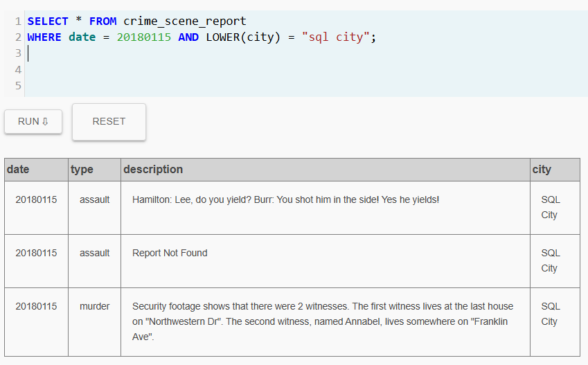
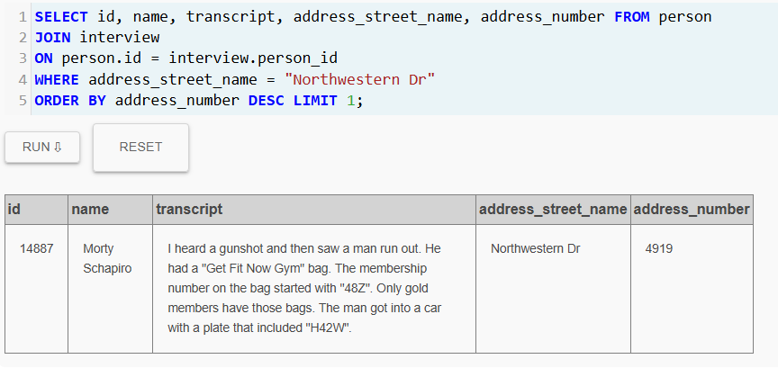
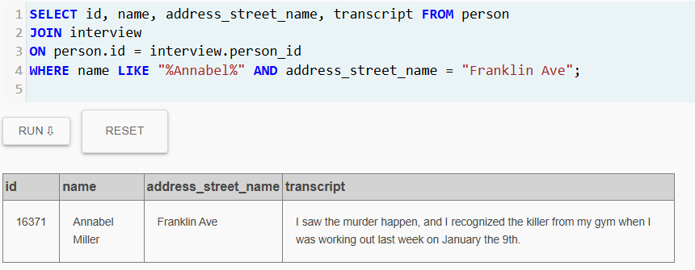

# lab2-sql-murder-CarolinaGomez

## Pefil del Detective
- **Nombre**: Carolina Gómez Osorno
- **Correo**: cgomez.osorno@udea.edu.co

## Contexto de la Investigación
El 15 de enero de 2018 un asesinato sacudió la aparente tranquilidad de SQL City. Como suele ocurrir en estos casos, todo comenzó con el informe inicial de la escena del crimen; sin embargo, dicho informe se extravió, dejando a la investigación sin un punto de partida.

Ante esta situación, la única fuente confiable para reconstruir los hechos son los registros almacenados en la base de datos del departamento de policía. Por ello, la investigación se ha centrado en examinar cuidadosamente cada tabla y cada registro, con la esperanza de que entre esos datos se encuentren pistas que conduzcan al culpable.

> [!important]
> **Estado del Caso:** En investigación.

## Resumen de la Investigación

## Bitácora de Investigación
### Query 1 - Reportes del Día del Crimen
```sql
SELECT * FROM crime_scene_report 
WHERE date = 20180115 AND LOWER(city) = "sql city";
```

**Evidencia**  


**Anotación**  
Antes de concentrarme únicamente en el asesinato, decidí revisar todos los reportes registrados en SQL City el 15 de enero de 2018.
  
Un crimen rara vez ocurre de forma aislada. A veces forma parte de algo más grande como un robo que salió mal, un enfrentamiento inesperado o incluso un accidente que terminó en tragedia, por lo que si quería comprender lo ocurrido, primero debía observar todo lo que sucedió ese día en la ciudad.

Al ejecutar la consulta, aparecieron tres registros correspondientes a esa fecha: dos reportes de asalto y un reporte de asesinato. Sin embargo, el reporte de asesinato contenía un detalle que llamó enormemente mi atención.

>[!important]
>**Pista clave encontrada en el reporte**  
>Las cámaras de seguridad muestran dos personas que fueron testigos del crimen:
>- El primer testigo vive en la última casa de Northwestern Dr.
>- El segundo testigo, llamado Annabel, vive en algún lugar de Franklin Ave.

>[!warning]
>La descripción del reporte no proporciona nombres completos ni direcciones exactas, por lo que será necesario consultar otras tablas de la base de datos para identificar a estos testigos y obtener sus declaraciones.

**Conclusión**  
El informe del crimen no solo confirmó el lugar y la fecha del asesinato, sino que también reveló la existencia de dos testigos potenciales.

La investigación ahora se dirige a localizar a estas personas dentro de los registros de SQL City.

### Query 2 - Identificando al Testigo de Northwestern Dr
```sql
SELECT id, name, transcript, address_number FROM person 
JOIN interview 
ON person.id = interview.person_id
WHERE address_street_name = "Northwestern Dr" 
ORDER BY address_number DESC LIMIT 1;
```

**Evidencia**  


**Anotación**  
El informe del asesinato mencionaba que uno de los testigos vivía en la última casa de Nothwestern Dr.

En lugar de revisar a todos los residentes de la calle, decidí aprovechar ese detalle del informe. Si podía identificar la casa con el número más alto, encontraría directamente a la persona que vivía en el extremo de la calle.

Para lograrlo, consulté las tablas *person* e *interview*, ordenando las direcciones de mayor a menor y limitando el resultado a un solo registro. De esta manera, obtendría directamente al residente de la última casa y su declaración.

>[!important]
>**Testigo identificado: Morty Schapiro**  

**Declaración del Testigo**  
Morty declaró haber eschuchado un disparo y haber visto a un hombre salir corriendo del lugar del crimen. Durante su testimonio proporcionó varios detalles importantes sobre el sospechoso.

>[!important]
>**Detalles proporcionados por el testigo:** 
>- El sospechoso llevaba una bolsa del gimnasio *"Get Fit Now Gym"*
>- El número de membresía de la bolsa comenzaba con "48Z"
>- Solo los miembros Gold poseen ese tipo de bolsa.
>- El sospechoso escapó en un auto cuya placa contenía "H42W"

**Conclusión**  
La información proporcionada por Morty Schapiro abre una nueva línea de investigación.

El detalle del gimnasio es particularmente valioso, ya que si el sospechoso es miembro Gold de *Get Fit Now Gym* y su número de membresía comienza con "48Z", los registros del gimnasio podrían permitir identificar exactamente quién es.

Además, el testigo afirma que el sospechoso escapó en un vehículo cuya placa tenía la secuencia "H42W", un dato que plantea una posibilidad interesante: si el vehículo ya estaba listo para la huida, el crimen pudo haber sido planeado con antelación. Incluso existe la posibilidad de que el sospechoso no estuviera solo y contara con un cómplice que condujera el auto.

Por el momento esta hipótesis no puede confirmarse, pero es un elemento que deberá tenerse en cuenta durante el resto de la investigación.

>[!note]
>Antes de seguir la pista del gimnasio *Get Fit Now Gym*, la investigación continuará con el segundo testigo mencionado en el reporte del crimen, una persona llamada Annabel que vive en Franklin Ave.  
>Su declaración podría aportar nuevos detalles sobre el sospechoso.

### Query 3 - Identificando al Segundo Testigo
```sql
SELECT id, name, address_street_name, transcript FROM person 
JOIN interview 
ON person.id = interview.person_id
WHERE name LIKE "%Annabel%" AND address_street_name = "Franklin Ave";
```

**Evidencia**  


**Anotación**  
El reporte del crimen mencionaba que el segundo testigo se llamaba Annabel y vivía en Franklin Ave. Con esa información decidí buscar directamente en los registros de personas que coincidieran con ese nombre en esa calle.

La consulta condujo a Annabel Miller, quien efectivamente había dado una declaración relacionada con el asesinato.

>[!important]
>**Testigo identificado: Annabel Miller**  

**Declaración del Testigo**  
Annabel afirmó haber presenciado el asesinato y aseguró haber reconocido al agresor.

Según su testimonio:
>"Vi ocurrir el asesinato y reconocí al asesino en mi gimnasio cuando estaba entrenando la semana pasada, el 9 de enero".

>[!important]
>**Nueva Pista Obtenida del Testimonio** 
>- Annabel reconoció al asesino en el gimnasio donde entrena.
>- Lo vio allí el 9 de enero, apenas seis días antes del asesinato.

**Conclusión**  
La declaración de Annabel resulta particularmente intersante porque confirma parcialmente lo dicho por el primer testigo. Morty Schapiro mencionó que el sospechoso llevaba una bolsa del gimnasio *Get Fit Now Gym*, mientras que Annabel asegura haber reconocido al asesino precisamente en su gimnasio.

Dos testigos apuntan hacia la misma pista: el gimnasio.

El detalle de la fecha también llama la atención. Annabel recuerda haber visto al sospechoso el 9 de enero, menos de una semana antes del asesinato. Esto podría indicar que el individuo frecuentaba el gimnasio regularmente o incluso que pudo haber estado preparando algo durante esos días. Sin embargo, por ahora no es posible saber si ese fue el inicio de la planificación del crimen o simplemente una coincidencia.

>[!note]
>Con ambos testimonios apuntando al mismo lugar, el siguiente paso de la investigación será examinar los registros del gimnasio *Get Fit Now Gym* en busca de miembros cuya información coincida con las pistas proporcionadas por los testigos.


