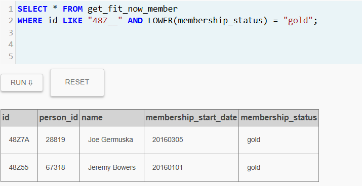
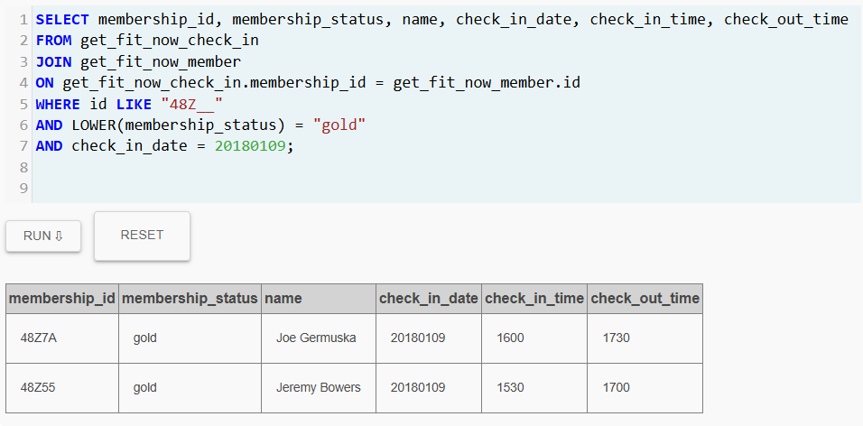
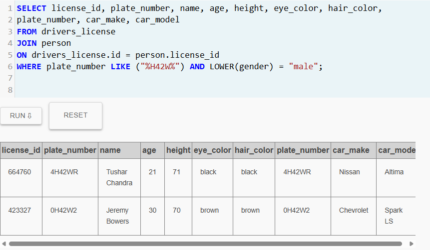
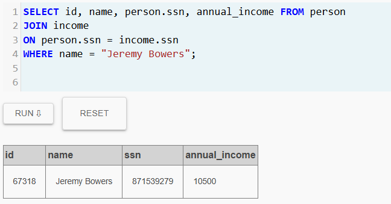
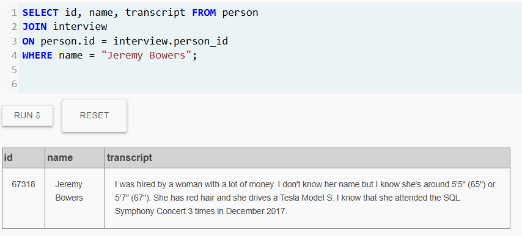
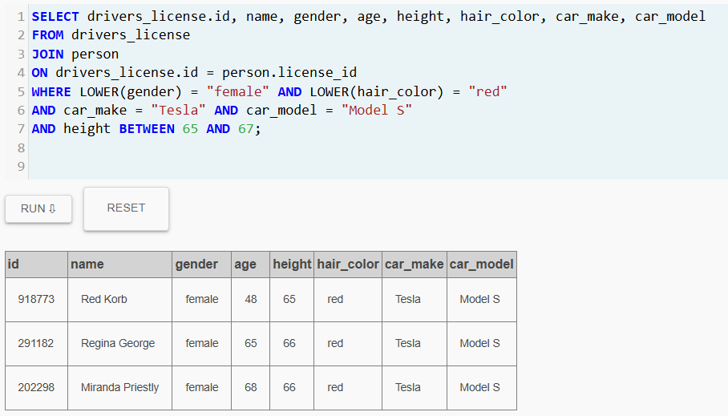
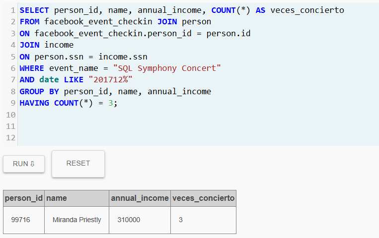
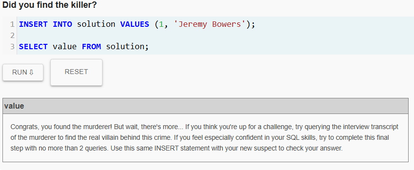
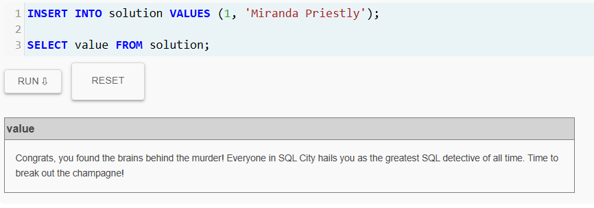

# lab2-sql-murder-CarolinaGomez

## Pefil del Detective
- **Nombre**: Carolina Gómez Osorno
- **Correo**: cgomez.osorno@udea.edu.co

## Contexto de la Investigación
El 15 de enero de 2018 un asesinato sacudió la aparente tranquilidad de SQL City. Como suele ocurrir en estos casos, todo comenzó con el informe inicial de la escena del crimen; sin embargo, dicho informe se extravió, dejando a la investigación sin un punto de partida.

Ante esta situación, la única fuente confiable para reconstruir los hechos son los registros almacenados en la base de datos del departamento de policía. Por ello, la investigación se ha centrado en examinar cuidadosamente cada tabla y cada registro, con la esperanza de que entre esos datos se encuentren pistas que conduzcan al culpable.

> [!important]
> **Estado del Caso:** Resuelto.

## Resumen del Caso
La investigación del asesinato ocurrido el 15 de enero de 2018 en SQL City permitió identificar a Jeremy Bowers como el autor material del crimen. A través del análisis de testimonios, registros del gimnasio, datos de vehículos y otras tablas de la base de datos de la ciudad, se logró reconstruir la secuencia de los hechos.

Durante su interrogatorio, Jeremy confesó haber sido contratado para cometer el asesinato, lo que condujo a descubrir a la verdadera responsable: Miranda Priestly, una mujer con altos ingresos que planificó y financió el crimen. 

Con estas evidencias se determinó que Jeremy Bowers actuó como ejecutor, mientras que Miranda Priestly fue la mente maestra detrás del asesinato.


## Bitácora de Investigación
### Query 1 - Reportes del Día del Crimen
```sql
SELECT * FROM crime_scene_report 
WHERE date = 20180115 AND LOWER(city) = "sql city";
```

**Evidencia**  


**Anotación**  
Antes de concentrarme únicamente en el asesinato, decidí revisar todos los reportes registrados en SQL City el 15 de enero de 2018.
  
Un crimen rara vez ocurre de forma aislada. A veces forma parte de algo más grande como un robo que salió mal, un enfrentamiento inesperado o incluso un accidente que terminó en tragedia, por lo que si quería comprender lo ocurrido, primero debía observar todo lo que sucedió ese día en la ciudad.

Al ejecutar la consulta, aparecieron tres registros correspondientes a esa fecha: dos reportes de asalto y un reporte de asesinato. Sin embargo, el reporte de asesinato contenía un detalle que llamó enormemente mi atención.

>[!important]
>**Pista clave encontrada en el reporte:**  
>Las cámaras de seguridad muestran dos personas que fueron testigos del crimen:
>- El primer testigo vive en la última casa de Northwestern Dr.
>- El segundo testigo, llamado Annabel, vive en algún lugar de Franklin Ave.

>[!warning]
>La descripción del reporte no proporciona nombres completos ni direcciones exactas, por lo que será necesario consultar otras tablas de la base de datos para identificar a estos testigos y obtener sus declaraciones.

**Conclusión**  
El informe del crimen no solo confirmó el lugar y la fecha del asesinato, sino que también reveló la existencia de dos testigos potenciales.

La investigación ahora se dirige a localizar a estas personas dentro de los registros de SQL City.

### Query 2 - Identificando al Testigo de Northwestern Dr
```sql
SELECT id, name, transcript, address_number FROM person 
JOIN interview 
ON person.id = interview.person_id
WHERE address_street_name = "Northwestern Dr" 
ORDER BY address_number DESC LIMIT 1;
```

**Evidencia**  


**Anotación**  
El informe del asesinato mencionaba que uno de los testigos vivía en la última casa de Nothwestern Dr.

En lugar de revisar a todos los residentes de la calle, decidí aprovechar ese detalle del informe. Si podía identificar la casa con el número más alto, encontraría directamente a la persona que vivía en el extremo de la calle.

Para lograrlo, consulté las tablas *person* e *interview*, ordenando las direcciones de mayor a menor y limitando el resultado a un solo registro. De esta manera, obtendría directamente al residente de la última casa y su declaración.

>[!important]
>**Testigo identificado: Morty Schapiro**  

**Declaración del Testigo**  
Morty declaró haber eschuchado un disparo y haber visto a un hombre salir corriendo del lugar del crimen. Durante su testimonio proporcionó varios detalles importantes sobre el sospechoso.

>[!important]
>**Detalles proporcionados por el testigo:** 
>- El sospechoso llevaba una bolsa del gimnasio *"Get Fit Now Gym"*
>- El número de membresía de la bolsa comenzaba con "48Z"
>- Solo los miembros Gold poseen ese tipo de bolsa.
>- El sospechoso escapó en un auto cuya placa contenía "H42W"

**Conclusión**  
La información proporcionada por Morty Schapiro abre una nueva línea de investigación.

El detalle del gimnasio es particularmente valioso, ya que si el sospechoso es miembro Gold de *Get Fit Now Gym* y su número de membresía comienza con "48Z", los registros del gimnasio podrían permitir identificar exactamente quién es.

Además, el testigo afirma que el sospechoso escapó en un vehículo cuya placa tenía la secuencia "H42W", un dato que plantea una posibilidad interesante: si el vehículo ya estaba listo para la huida, el crimen pudo haber sido planeado con antelación. Incluso existe la posibilidad de que el sospechoso no estuviera solo y contara con un cómplice que condujera el auto.

Por el momento esta hipótesis no puede confirmarse, pero es un elemento que deberá tenerse en cuenta durante el resto de la investigación.

>[!note]
>Antes de seguir la pista del gimnasio *Get Fit Now Gym*, la investigación continuará con el segundo testigo mencionado en el reporte del crimen, una persona llamada Annabel que vive en Franklin Ave.  
>Su declaración podría aportar nuevos detalles sobre el sospechoso.

### Query 3 - Identificando al Segundo Testigo
```sql
SELECT id, name, address_street_name, transcript FROM person 
JOIN interview 
ON person.id = interview.person_id
WHERE name LIKE "%Annabel%" AND address_street_name = "Franklin Ave";
```

**Evidencia**  


**Anotación**  
El reporte del crimen mencionaba que el segundo testigo se llamaba Annabel y vivía en Franklin Ave. Con esa información decidí buscar directamente en los registros de personas que coincidieran con ese nombre en esa calle.

La consulta condujo a Annabel Miller, quien efectivamente había dado una declaración relacionada con el asesinato.

>[!important]
>**Testigo identificado: Annabel Miller**  

**Declaración del Testigo**  
Annabel afirmó haber presenciado el asesinato y aseguró haber reconocido al agresor.

Según su testimonio:
>"Vi ocurrir el asesinato y reconocí al asesino en mi gimnasio cuando estaba entrenando la semana pasada, el 9 de enero".

>[!important]
>**Nueva pista obtenida del testimonio:** 
>- Annabel reconoció al asesino en el gimnasio donde entrena.
>- Lo vio allí el 9 de enero, apenas seis días antes del asesinato.

**Conclusión**  
La declaración de Annabel resulta particularmente intersante porque confirma parcialmente lo dicho por el primer testigo. Morty Schapiro mencionó que el sospechoso llevaba una bolsa del gimnasio *Get Fit Now Gym*, mientras que Annabel asegura haber reconocido al asesino precisamente en su gimnasio.

Dos testigos apuntan hacia la misma pista: el gimnasio.

El detalle de la fecha también llama la atención. Annabel recuerda haber visto al sospechoso el 9 de enero, menos de una semana antes del asesinato. Esto podría indicar que el individuo frecuentaba el gimnasio regularmente o incluso que pudo haber estado preparando algo durante esos días. Sin embargo, por ahora no es posible saber si ese fue el inicio de la planificación del crimen o simplemente una coincidencia.

>[!note]
>Con ambos testimonios apuntando al mismo lugar, el siguiente paso de la investigación será examinar los registros del gimnasio *Get Fit Now Gym* en busca de miembros cuya información coincida con las pistas proporcionadas por los testigos.

### Query 4 - Investigando los Registros del Gimnasio 
```sql
SELECT * FROM get_fit_now_member 
WHERE id LIKE "48Z__" AND LOWER(membership_status) = "gold"; 
```

**Evidencia**  


**Anotación**  
Ambos testimonios apuntaban en la misma dirección: el gimnasio *"Get Fit Now Gym"*.

El primer testigo mencionó que el sospechoso llevaba una bolsa del gimnasio cuyo número de membresía comenzaba con "48Z" y que solo los miembros Gold poseen ese tipo de bolsa.

Al revisar la tabla get_fit_now_member, noté que los identificadores de membresía tenían una longitud de cinco caracteres y con ello logré construir un filtro más preciso: buscar membresías que comenzaran con "48Z" y tuvieran exactamente dos caracteres adicionales, y estuvieran clasificadas como Gold.

El resultado redujo considerablemente la lista de posibles sospechosos.


>[!important]
>**Miembros que coinciden con la descripción del testigo:**  
>- Joe Germuska - ID Membresía = 48Z7A
>- Jeremy Bowers - ID Membresía = 48Z55

**Conclusión**  
Por el momento ambos individuos cumplen con las condiciones mencionadas por los testigos: son miembros Gold del gimnasio y su número de membresía comienza con "48Z". Sin embargo, esto aún no es suficiente para determinar cuál de los dos es el responsable.

Afortunadamente, el testimonio de Annabel Miller proporciona un detalle adicional que puede ayudar a reducir aún más la lista: ella afirmó haber visto al sospechoso en el gimnasio el 9 de enero.

Si alguno de estos miembros estuvo presente en el gimnasio ese día, podría tratarse de nuestro sospechoso.

>[!note]
>El siguiente paso será revisar los registros de entrada al gimnasio para determinar cuál de estos miembros visitó el establecimiento el 9 de enero, tal como lo mencionó Annabel en su declaración.

### Query 5 - Verificando Check In del Gimnasio 
```sql
SELECT membership_id, membership_status, name, check_in_date, check_in_time, check_out_time 
FROM get_fit_now_check_in 
JOIN get_fit_now_member
ON get_fit_now_check_in.membership_id = get_fit_now_member.id
WHERE id LIKE "48Z__" 
AND LOWER(membership_status) = "gold" 
AND check_in_date = 20180109; 
```

**Evidencia**  


**Anotación**  
La declaración de Annabel Miller indicaba que había visto al sospechoso en el gimnasio el 9 de enero.

Con esa información, decidí revisar los registros de entrada al gimnasio corresponiente a esa fecha, enfocándome únicamente en los dos miembros Gold cuyo número de membresía comenzaba con "48Z".

El objetivo era comprobar cuál de los dos había estado presente ese día, tal como mencionó la testigo.


>[!important]
>**Resultado de la verificación:**  
>Ambos miembros estuvieron en el gimnasio el 9 de enero de 2018:
>- Joe Germuska ingresó a las 16:00 y salió a las 17:30.
>- Jeremy Bowers ingresó a las 15:30 y salió a las 17:00.

**Conclusión**  
La verificación confirma que ambos individuos estuvieron en el gimnasio el mismo día mencionado por Annabel. Esto significa que los dos siguen siendo posibles sospechosos, ya que ninguno puede descartarse basándose únicamente en esta pista.

Por lo tanto, será necesario recurrir al último detalle proporcionado por el primer testigo: la placa parcial del vehículo utilizado en la huida, que contenía la secuencia "H42W".

>[!note]
>El siguiente paso de la investigación será examinar los registros de vehículos de la ciudad para identificar autos cuya placa contenga "H42W".  
>Esta pista podría permitir vincular definitivamente a uno de los sospechosos con la escena del crimen.

### Query 6 - Siguiendo la Pista de la Matrícula
```sql
SELECT license_id, plate_number, name, age, height, eye_color, hair_color,
plate_number, car_make, car_model 
FROM drivers_license
JOIN person
ON drivers_license.id = person.license_id
WHERE plate_number LIKE ("%H42W%") AND LOWER(gender) = "male"; 
```

**Evidencia**  


**Anotación**  
El primer testigo afirmó haber visto a un hombre salir de la escena del crimen subiendo a un vehículo cuya matrícula contenía la secuencia "H42W".

Con esta información, decidí consultar los registros de licencias de conducir y vehículos de la ciudad, filtrando únicamente conductores masculinos cuyas placas incluyeran esa cadena específica.

El objetivo era identificar posibles coincidencias que pudieran relacionarse con los sospechosos que ya habían aparecido en la investigación.


>[!important]
>**Resultado de la búsqueda:**  
>Se encontraron dos conductores con matrículas que contienen la secuencia "H42W":
>- Tushar Chandra, que conduce un Nissan Altima con placa 4H42WR
>- Jeremy Bowers, que conduce un Chevrolet Spark LS con placa 0H42W2

**Conclusión**  
Al comparar estos resultados con las pistas obtenidas anteriormente, surge un detalle clave: aunque ambos vehículos coinciden con la matrícula parcial, solo Jeremy Bowers aparece en los registros del gimnasio el 9 de enero de 2018, la misma fecha mencionada por Annabel Miller.

Por otro lado, Tushar Chandra no aparece en los registros del gimnasio, lo que debilita cualquier conexión directa con la declaración de la testigo.

Todo apunta a que Jeremy Bowers encaja con todas las pistas hasta ahora:

- Es hombre, tal como indicó Morty, el primer testigo.
- Su matrícula contiene la secuencia "H42W".
- Estuvo en el gimnasio el 9 de enero, la fecha mencionada por Annabel.
- Es miembro Gold del gimnasio y su id de membresía comienza por "48Z"

Esto convierte a Jeremy Bowers en el principal sospechoso del caso.

>[!note]
>El siguiente paso de la investigación será examinar más información sobre Jeremy Bowers, incluyendo posibles registros financieros u otros datos que puedan revelar si actuó solo o si alguien más estuvo involucrado en el crimen.

### Query 7 - Explorando los Registros Financieros del Sospechoso
```sql
SELECT id, name, person.ssn, annual_income FROM person 
JOIN income
ON person.ssn = income.ssn
WHERE name = "Jeremy Bowers";
```

**Evidencia**  


**Anotación**  
Con Jeremy Bowers convertido en el principal sospechoso tras el análisis de la matrícula del vehículo, decidí examinar un aspecto diferente de su perfil: su situación financiera.

Antes de revisar su declaración, consideré prudente inspeccionar sus ingresos anuales registrados en la base de datos, ya que en muchas investigaciones se ha detectado que los problemas económicos pueden convertirse en un posible motivo para cometer un crimen.

Por ello y con el fin de recuperar el registro financiero correspondiente a Jeremy Bowers, consulté la tabla income.

>[!important]
>**Resultado obtenido:**  
>Se encontró un único registro financiero asociado al sospechoso:
>- **Nombre:** Jeremy Bowers
>- **Número de Seguro Social:** 871539279
>- **Ingreso Anual:** 10,500

**Conclusión**  
La cifra resulta considerablemente baja, especialmente teniendo en cuenta que Jeremy Bowers tiene 30 años de edad.

Un ingreso anual de 10,500 dólares podría indicar una situación económica complicada, particularmente si el individuo vive de una manera independiente. Aunque esta información no prueba nada por sí sola, sí plantea una posibilidad: un posible motivo económico.

>[!warning]
>Las cifras por si solas no son suficientes para demostrar culpabilidad.

>[!note]
>El siguiente paso será examinar la declaración de Jeremy Bowers, con el fin de determinar si su testimonio revela nuevas pistas o si intenta ocultar algo relacionado con el crimen.

### Query 8 - La Confesión del Ejecutor
```sql
SELECT id, name, transcript FROM person 
JOIN interview
ON person.id = interview.person_id
WHERE name = "Jeremy Bowers";
```

**Evidencia**  


**Anotación**  
Con Jeremy Bowers convertido en el principal sospechoso, el siguiente paso lógico era revisar su declaración oficial registrada en la base de datos.

Para ello consulté la tabla interview, buscando específicamente la entrevista asociada al sospechoso.

El objetivo era determinar si el sospechoso admitía algún tipo de implicación en el crimen o si su declaración contenia detalles que permitieran reconstruir mejor lo ocurrido.

>[!important]
>**Resultado de la declaración:**  
>Jeremy Bowers confesó información crucial:
>> *"Me contrató una mujer con mucho dinero. No sé su nombre, pero sé que mide entre 5'5" (65") o 5'7" (67"). Es pelirroja y conduce un Tesla Model S. Sé que asistió al SQL Symphony Concert tres veces en diciembre de 2017".*

**Conclusión**  
El asesinato no fue un acto impulsivo ni un accidente. Todo apunta a que fue un crimen planeado con anticipación.

Jeremy Bowers no parece ser el autor intelectual del asesinato, sino el ejecutor contratado para llevarlo a cabo. Esto también refuerza la hipótesis planteada anteriormente: el dinero pudo haber sido su principal motivación.

La declaración proporciona varias características clave sobre la verdadera mente detrás del crimen:

- Mujer.
- Cabello rojo.
- Estatura entre 65 y 67 pulgadas.
- Conduce un Tesla Model S.
- Asistió tres veces al SQL Symphony Concert en diciembre de 2017.
- Posee una gran cantidad de dinero.

>[!warning]
>Esto significa que el verdadero cerebro del asesinato sigue libre.
>
>Jeremy Bowers fue solo una pieza dentro de un plan mayor.


>[!note]
>El siguiente paso será utilizar estas características para rastrear a la misteriosa mujer en los registros de la ciudad. Especialmente será útil revisar los registros de características físicas similares a las de la mujer descrita.
>
> Si la base de datos contiene registros de asistencia a este evento, esa podría ser la pista definitiva para identificar al verdadero culpable.

### Query 9 - Siguiendo el Rastro de la Autora Intelectual
```sql
SELECT drivers_license.id, name, gender, age, height, hair_color, car_make, car_model 
FROM drivers_license 
JOIN person
ON drivers_license.id = person.license_id
WHERE LOWER(gender) = "female" AND LOWER(hair_color) = "red"
AND car_make = "Tesla" AND car_model = "Model S" 
AND height BETWEEN 65 AND 67;
```

**Evidencia**  


**Anotación**  
La confesión de Jeremy Bowers proporcionó por primera vez una descripción clara de la persona que lo contrató.

Aunque no conocía su nombre, sí recordaba varios detalles específicos: se trataba de una mujer de cabello rojo, con una estatura aproximada entre 65 y 67 pulgadas, que conducía un Tesla Model S.

Con esta información decidí acudir a los registros de licencias de conducción de SQL City, ya que si la mujer realmente posee ese vehículo, su información debería aparecer registrada junto con sus características físicas.

>[!important]
>**Resultado búsqueda:**  
>La consulta redujo la lista a tres posibles candidatas:
>- Red Korb con ID 918773, estatura 65" y 48 años.
>- Regina George con ID 291182, estatura 66" y 65 años.
>- Miranda Priestly con ID 202298, estatura 66" y 68 años.

**Conclusión**  
El caso comienza a cerrarse.

De los 10007 registros de licencias en la ciudad, solo tres mujeres cumplen exactamente con la descripción proporcionada por Jeremy. Esto sugiere que la autora intelectual del asesinato probablemente se encuentra entre estas tres entidades.

Sin embargo, aún falta una pieza clave del rompecabezas: Jeremy también mencionó que la mujer asistió tres veces al SQL Symphony Concert durante diciembre de 2017. 

Ese detalle es demasiado específico para ignorarlo.

>[!warning]
>Si logramos identificar cuál de estas tres mujeres asistió repetidamente a ese concierto, podremos identificar con certeza a la persona que planeó el asesinato y así cerrar el caso.


>[!note]
>El siguiente paso será consultar los registros de asistencia a eventos para verificar si alguna de estas tres personas aparece asociada al SQL Symphony Concert en 2017.


### Query 10 - Identificando a la Mente Maestra
```sql
SELECT person_id, name, annual_income, COUNT(*) AS veces_concierto 
FROM facebook_event_checkin JOIN person
ON facebook_event_checkin.person_id = person.id
JOIN income
ON person.ssn = income.ssn
WHERE event_name = "SQL Symphony Concert" 
AND date LIKE "201712%"
GROUP BY person_id, name, annual_income 
HAVING COUNT(*) = 3;
```

**Evidencia**  


**Anotación**  
La última pista proporcionada por Jeremy Bowers era particularmente específica: la mujer que lo contrató había asistido tres veces al SQL Symphony Concert durante diciembre de 2017.

Con esa información decidí examinar los registros de facebook_event_checkin, donde se almacenan los eventos a los que han asistido los ciudadanos de SQL City.

La consulta se centró exclusivamente en:

- El evento SQL Symphony Concert.
- Fechas correspondientes a diciembre de 2017.
- Personas que asistieron exactamente tres veces.

Además, decidí enlazar estos registros con la tabla income con el fin de verificar si la persona identificada coincidía con la descripción de Jeremy: una mujer con mucho dinero.

>[!important]
>**Resultado búsqueda:**  
>La consulta produjo un único resultado:
>- Miranda Priestly, con un ingreso anual de 310,000

**Conclusión**  
Todas las piezas del rompecabezas finalmente encajan.

La persona identificada, Miranda Priestly, cumple cada una de las condiciones reveladas durante la investigación:

- Coinicide con la descripción física obtenida a partir de los registros de licencias.
- Conduce un Tesla Model S.
- Posee cabello rojo y estatura aproximada mencionada por Jeremy.
- Tiene un ingreso anual extremadamente alto, lo que concuerda con la afirmación de que *"era una mujer con mucho dinero"*.
- Y, finalmente, asistió exactamente tres veces al SQL Symphony Concert en diciembre de 2017, tal como afirmó el ejecutor del crimen.


>[!important]
>Con toda la evidencia reunida queda claro que Miranda Priestly es la autora intelectual del asesinato.
>
>Jeremy Bowers actuó únicamente como el ejecutor contratado, mientras que ella fue quien planeó y financió el crimen.

### Query 11 - Confirmación del Asesino
```sql
INSERT INTO solution VALUES (1, 'Jeremy Bowers');

SELECT value FROM solution;
```

**Evidencia**  


**Anotación**  
Tras reunir múltiples pistas (los testimonios de los testigos, los registros del gimnasio, la coincidencia con la matrícula del vehículo y finalmente la declaración del propio sospechoso), todas las evidencias apuntaban hacia Jeremy Bowers como el autor material del crimen.

Para confirmar oficialmente esta conclusión dentro del sistema de investigación, procedí a registrar su nombre en la tabla solution, utilizada por la plataforma para verificar si el culpable identificado coincide con el asesino real.

>[!important]
>**Resultado de la verificación:**  
>El sistema respondió con el siguiente mensaje: 
>
>*¡Felicidades, encontraste al asesino!*.  
>
>Esta confirmación indica que Jeremy Bowers es efectivamente el asesino que ejecutó el crimen.

**Conclusión**  
Con esta verificación queda demostrado que la investigación siguió el rastro correcto. Sin embargo, el propio Jeremy dejó claro que no actuó por iniciativa propia.

>[!important]
>A lo largo de la investigación ya se logró identificar a una posible autora intelectual: Miranda Priestly, quien coincide con todas las características descritas por Jeremy y con los registros del concierto.

>[!note]
>Aún falta realizar la verificación final dentro del sistema para verificar oficialmente que Miranda Priestly es la verdadera mente maestra detrás del crimen.

### Query 12 - Confirmación de la Mente Maestra
```sql
INSERT INTO solution VALUES (1, 'Miranda Priestly');

SELECT value FROM solution;
```

**Evidencia**  


**Anotación**  
Tras seguir cada pista con precisión (desde los testimonios de Jeremy Bowers hasta los registros de eventos de la ciudad), todas las evidencias apuntaban hacia Miranda Priestly como la persona que había planeado el asesinato.

Jeremy Bowers había confesado que fue contratado por una mujer con mucho dinero, describiéndola además con varias características muy concretas: cabello rojo, estatura aproximada entre 65 y 67 pulgadas, propietaria de un Tesla Model S y asistente frecuente al SQL Symphony Concert en diciembre de 2017.

Las consultas realizadas en las tablas de drivers_license y facebook_event_checkin perimitieron identificar a una única persona que coincidía con todos esos elementos. Sin embargo, como en todo buen caso policial, era necesario confirmar oficialmente la conclusión dentro del sistema de investigación.

Para ello se registró el nombre de la sospechosa en la tabla solution, del mismo modo en que se había hecho previamente con el asesino material.

>[!important]
>**Resultado de la verificación:**  
>El sistema respondió con el siguiente mensaje: 
>
>*¡Felicidades, encontraste al cerebro detrás del asesinato! En SQL City, todos te aclaman como el mejor detective de SQL de todos los tiempos. ¡Es hora de descorchar el champán!*.  
>
>Esta confirmación indica que Miranda Priestly es efectivamente la mente maestra detrás del crimen.

**Conclusión**  
El caso finalmente queda completamente solucionado:

- Jeremy Bowers fue el asesino material, quien ejecutó el crimen.

- Miranda Priestly fue la mente maestra, quien planificó y financió el asesinato.

Cada pieza de información permitió reconstruir cuidadosamente los hechos hasta revelar la verdad.

Lo que comenzó como un caso complicado, con un informe de escena de crimen perdido, terminó resolviéndose gracias a un meticuloso análisis de los datos almacenados en la base de SQL City.

>[!important]
>**Estado del Caso:** Resuelto
>
>Los responsables han sido identificados y la investigación puede darse por concluida.